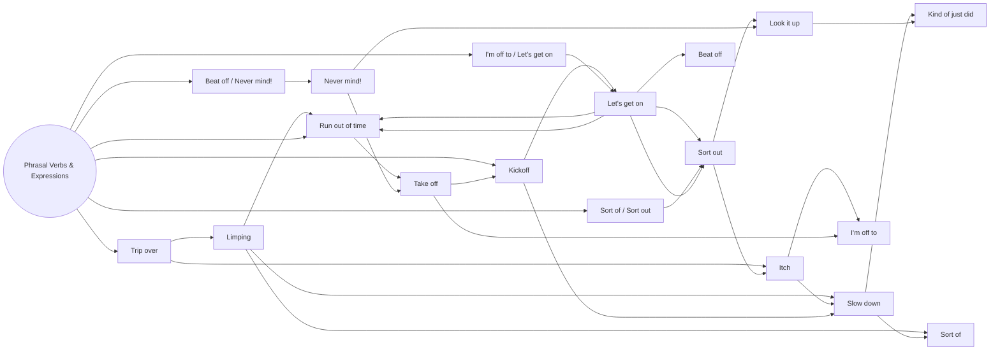

# Expression Mapping & Associative Chains

---
# Trip over (Idea: To stumble on something / make a mistake)

* slip: You lose balance on a wet surface.

* trip: You hit your foot on something and lose balance

* stumble: You lose balance while walking 

* tumble: You fall and roll over
---

## Kickoff (Idea: Kick off / Start things off)

## Run out of time (Idea: End up running out of time)

---
## Sort of 

"Sort of" means somewhat, approximately, or a little bit. People use it when they want to describe something in a way that is not exact or 100% precise

---
## Sort out (Idea: Resolve / Organize)

---
## I’m off to (Idea: Leaving for / Heading out to)

"I'm off to" means you are leaving to go somewhere, while "give up" means you stop trying or quit a habit.

---
## Beat off (Idea: Push back / Overcome / Go for it)

The phrasal verb `Beat off` means to force someone or something to go away or to fight off an attack, similar to pushing back or overcoming an opponent.

Common Meanings and Uses

* Fight off an attack: To successfully defend against an attacker, enemy, or rival.
* Push back competition: To hold off or defeat competitors in a game, business, or race.
* Overcome difficulty: To successfully deal with a hard problem or challenge.Examples in Sentences

---

## Take off (Idea: Leave quickly / Take off)

## Never mind! (Idea: Never mind! / Forget it!)
