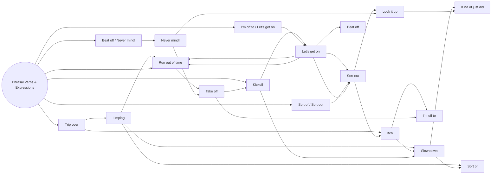

# Expression Mapping & Associative Chains

## Trip over (Idea: To stumble on something / make a mistake)
* Trip over → Limping (Idea: Limping)

    Limping → Run out of time (Idea: End up running out of time)

    Limping → Slow down (Idea: Slow down / Reduce speed)

    Limping → Sort of (Idea: Kind of / Sort of)

* Trip over → Itch (Idea: Itch / Eager to do something)

    Itch → I’m off to (Idea: Leaving for / Heading out to)

    Itch → Slow down (Idea: Slow down / Reduce speed)

Idea: Kick off, get going with work, and end up running out of time.

Phrase( Kickoff → Let’s get on → Run out of time )

## Kickoff (Idea: Kick off / Start things off)
* Kickoff → Slow down (Idea: Slow down / Reduce speed)

    Slow down → Kind of just did (Idea: Kind of just did)

    Slow down → Sort of (Idea: Kind of / Sort of)

* Kickoff → Let’s get on (Idea: Get on with it / Get to work)

    Let’s get on → Run out of time (Idea: End up running out of time)

    Let’s get on → Sort out (Idea: Resolve / Organize)

Idea: End up running out of time, leave quickly, and kick things off.

Phrase( Run out of time → Take off → Kickoff )

## Run out of time (Idea: End up running out of time)
* Run out of time → Take off (Idea: Leave quickly / Take off)

    Take off → Kickoff (Idea: Kick off / Start things off)

    Take off → I’m off to (Idea: Leaving for / Heading out to)

Idea: Kind of, resolve/organize things, and look it up / search.

Phrase( Sort of → Sort out → Look it up )

## Sort of (Idea: Kind of / Sort of)
* Sort of → Sort out (Idea: Resolve / Organize)

    Sort out → Itch (Idea: Itch / Eager to do something)

    Sort out → Look it up (Idea: Search / Take a look)

Idea: Resolve / Organize, look something up, and kind of just did.

Phrase( Sort out → Look it up → Kind of just did )

## Sort out (Idea: Resolve / Organize)
* Sort out → Look it up (Idea: Search / Take a look)

    Look it up → Kind of just did (Idea: Kind of just did)

Idea: Leaving for somewhere, getting down to work, and going for it / giving it a shot.

Phrase( I’m off to → Let’s get on → Beat off )

## I’m off to (Idea: Leaving for / Heading out to)
* I’m off to → Let’s get on (Idea: Get on with it / Get to work)

    Let’s get on → Beat off (Idea: Push back / Overcome / Go for it)

    Let’s get on → Sort out (Idea: Resolve / Organize)

Idea: Go for it, forget about it, and leave quickly.

Phrase( Beat off → Never mind! → Take off )

## Beat off (Idea: Push back / Overcome / Go for it)
* Beat off → Never mind! (Idea: Never mind! / Forget it!)

    Never mind! → Look it up (Idea: Search / Take a look)

    Never mind! → Take off (Idea: Leave quickly / Take off)

Idea: Leave quickly and be off to go for it.

Phrase( Take off → I’m off to → Beat off )

## Take off (Idea: Leave quickly / Take off)
* Take off → I’m off to (Idea: Leaving for / Heading out to)

    I’m off to → Beat off (Idea: Push back / Overcome / Go for it)

Idea: Forget about it, leave quickly, and head out somewhere.

Phrase( Never mind! → Take off → I’m off to )

## Never mind! (Idea: Never mind! / Forget it!)
* Never mind! → Take off (Idea: Leave quickly / Take off)

    Take off → I’m off to (Idea: Leaving for / Heading out to)

# Expression Mapping & Associative Chains: Practical Dialogues

This document brings together practical dialogues based on the **Expression Mapping and Associative Chains**, contextualized in the **daily lives of two adults in a mid-sized city** (intermediate level).

---

## 1. Expression: `Trip over` (Stumble / Mess up)

### Chain 1A: `Trip over` → `Limping`
> **Idea:** Stumble over something or mess up in daily routine and end up limping/impaired.

* **Option 1: In the home garden**

  — Be careful in the backyard; I almost tripped over the garden hose earlier today.

  — Oh, that explains why you were limping when you walked into the kitchen! Are you okay?

* **Option 2: Leaving the office**

  — I tripped over that uneven pavement right outside our office block this afternoon.  

  — Ouch! I saw you limping near the bus stop and wondered what happened to your leg.

---

### Chain 1B: `Limping` → `Run out of time`
> **Idea:** Being in a slow/impaired pace and ending up running out of time.

* **Option 1: Preparations for a local meeting**

  — Since I’m still limping from yesterday’s injury, I’m walking way slower than usual.  

  — Don't stress, but if we don't leave now, we’ll run out of time before the store closes.

* **Option 2: Walk to the station/bus stop**

  — Stop rushing me! Can't you see I’m limping after that morning jog?  

  — I know, but we’ll run out of time to catch the 5 o'clock train to downtown.

---

### Chain 1C: `Limping` → `Slow down`
> **Idea:** Limping and needing to slow down the pace.

* **Option 1: Walk in the city park**

  — Hey, you’re limping a bit. Did you hurt your ankle during your workout?  

  — Yeah, a little bit. Let's slow down for a minute and sit on that bench over there.

* **Option 2: Shopping downtown**

  — I notice you’re limping every time we cross the street.  

  — My knee is killing me today, so please slow down so I can keep up with you.

---

### Chain 1D: `Limping` → `Sort of`
> **Idea:** Moderately limping / "Sort of".

* **Option 1: Arriving home after work**

  — Are you limping? Did something happen on your way home?  

  — Sort of. My shoes are really uncomfortable, but it’s nothing serious.

* **Option 2: Meeting at the coffee shop**

  — Why are you limping like that? Did you twist your foot again?  

  — Sort of. I had a minor stumble this morning, but I'll be fine in a couple of hours.

---

### Chain 1E: `Trip over` → `Itch`
> **Idea:** Stumble/make a mistake and get an itch/urge to change something.

* **Option 1: Caution with home renovation/decor**

  — I almost tripped over the new rug in the hallway twice this morning.  

  — I have an itch to rearrange the furniture in that room anyway, so let’s move it today.

* **Option 2: Neighborhood walk**

  — Watch out! You might trip over those loose tree roots on the sidewalk.  

  — Thanks! Every time I walk past this old trail, I get an itch to go hiking in the hills.

---

### Chain 1F: `Itch` → `I’m off to`
> **Idea:** Urge to do something and leaving right away to get it done.

* **Option 1: Craving iced coffee**

  — I’ve had an itch for a good iced coffee all afternoon.

  — Perfect timing! I’m off to the bakery around the corner, so I can grab one for you.

* **Option 2: Project idea / hobby**

  — I’ve got a real itch to try out that new gym that opened downtown.  

  — Great! I’m off to sign up for a membership right now, so come with me!

---

### Chain 1G: `Itch` → `Slow down`
> **Idea:** Impulses/eagerness to do something vs. the need to slow down.

* **Option 1: Planning big purchases**

  — I really have an itch to buy a new car this weekend while they have discount deals. 

  — You need to slow down and check our budget first before making any quick decisions.

* **Option 2: Starting a new home project**

  — I have an itch to paint the entire living room this Saturday morning. 

  — Whoa, slow down! We haven't even picked the colors or bought the brushes yet.

---

## 2. Expression: `Kickoff` (Start off / Begin)

### Chain 2A: `Kickoff` → `Slow down`
> **Idea:** Starting something and realizing the need to slow down.

* **Option 1: Neighborhood committee meeting**

  — Right after the kickoff of our community project, everybody started shouting ideas at once.  

  — We really had to ask everyone to slow down so we could write everything down properly.

* **Option 2: Weekend house cleaning**

  — As soon as we did the kickoff for cleaning the garage, you started throwing everything away!  

  — Okay, fair enough. I’ll slow down and check with you before tossing anything valuable out.

---

### Chain 2B: `Slow down` → `Kind of just did`
> **Idea:** Asking to slow down and having the other person answer that they kind of just did.

* **Option 1: In city traffic**

  — Hey, you need to slow down a bit; the speed limit changes near this school zone.  

  — I kind of just did! Check the speedometer, I’m driving under forty now.

* **Option 2: Working from home routine**

  — Can you slow down and take a breather? You’ve been working non-stop all morning.  

  — I kind of just did while you were outside watering the plants, but thanks for caring.

---

### Chain 2C: `Slow down` → `Sort of`
> **Idea:** Slow down a little / "Sort of".

* **Option 1: Late afternoon walk**

  — Did the doctor tell you to slow down on your daily exercises for a while?  

  — Sort of. He said light walking is fine, but I shouldn't go for long runs yet.

* **Option 2: Spending pace**

  — We should probably slow down on eating out every night this month.  

  — Sort of, yeah. But cooking every single day after work is just so exhausting!

---

### Chain 2D: `Kickoff` → `Let’s get on`
> **Phrase:** `Kickoff` → `Let’s get on` → `Run out of time`  
> **Idea:** Kick off, get to work, and end up running out of time.

* **Option 1: Weekend project at home**

  — Now that the project kickoff is out of the way, let’s get on with fixing the garage door.

  — Good idea, because if we delay any longer, we’ll run out of time before it gets dark.

* **Option 2: Organizing a family event**

  — After our brief kickoff meeting, let’s get on preparing the guest list for the barbecue. 

  — Exactly. Otherwise, we’ll run out of time to send out the invitations today.

---

### Chain 2E: `Let’s get on` → `Run out of time`
> **Idea:** Get down to work so as not to run out of time.

* **Option 1: Cooking for guests**

  — Let’s get on with making the dessert before our friends arrive.  

  — Yes! We’ll run out of time if we don't put it in the fridge right away.

* **Option 2: Assembling furniture**

  — Let’s get on assembling this bookshelf we bought yesterday.  

  — Agreed. We’ll run out of time before dinner if we keep reading the instructions over and over.

---

### Chain 2F: `Let’s get on` → `Sort out`
> **Idea:** Start working and resolve/organize things.

* **Option 1: Household paperwork and bills**

  — Let’s get on with our Sunday routine and clean up the study desk. 

  — Great, that will help us sort out all the unpaid bills and documents from last month.

* **Option 2: Trip planning**

  — Let’s get on with our vacation plan before the flight prices go up.  

  — Awesome. First, let's sort out which hotel has the best reviews near the center.

---

## 3. Expression: `Run out of time` (Run out of time)

### Chain 3A: `Run out of time` → `Take off`
> **Phrase:** `Run out of time` → `Take off` → `Kickoff`  
> **Idea:** End up running out of time, leave quickly, and kick off another commitment.

* **Option 1: In a rush for an appointment**

  — We’re going to run out of time if we stay here chatting in the driveway!  

  — You’re right, I need to take off now if I want to be present for the match kickoff at six.

* **Option 2: Leaving the office**

  — I always run out of time on Friday afternoons with these late calls.  

  — Same here! Let’s take off right now so we don't miss the kickoff of the concert downtown.

---

### Chain 3B: `Take off` → `Kickoff`
> **Idea:** Leave quickly to start something off.

* **Option 1: Going to watch a local match**

  — I have to take off immediately or I’ll miss the start of the game.  

  — Go ahead! The kickoff is in fifteen minutes and traffic is heavy.

* **Option 2: Start of a course/workshop**

  — I’m going to take off early from work today.  

  — Smart move. The workshop kickoff starts at five sharp across town.

---

### Chain 3C: `Take off` → `I’m off to`
> **Idea:** Leave quickly and announce the destination.

* **Option 1: Heading to the gym**

  — I need to take off before the rain starts.  

  — Alright! I’m off to the local gym myself, so see you later tonight.

* **Option 2: Appointment at the bank/downtown**

  — Grab your keys, we need to take off in two minutes! 
  
  — Okay, okay! I’m off to the bank first, and then I’ll meet you at the market.

---

## 4. Expression: `Sort of` (Kind of / Sort of)

### Chain 4A: `Sort of` → `Sort out`
> **Phrase:** `Sort of` → `Sort out` → `Look it up`  
> **Idea:** Sort of, resolve things, and search/look it up.

* **Option 1: Doubt about how a new home appliance works**

  — Do you know how to operate this new coffee maker?  

  — Sort of. Let’s try to sort out the main settings first, and if that fails, we can look it up online.

* **Option 2: Simple mechanical issue on the car**

  — Is the car noise fixed completely?  

  — Sort of. I managed to sort out the loose cover, but we should look it up on YouTube just to be safe.

---

### Chain 4B: `Sort out` → `Itch`
> **Idea:** Resolve pending tasks and feel like doing something else.

* **Option 1: Finished housework**

  — Once we sort out all these old boxes in the attic, we’ll have plenty of space.  

  — True! Every time we finish a big cleanup, I get an itch to redecorate the whole room.

* **Option 2: Organized finances**

  — Now that we finally sorted out our monthly budget, we know how much we saved.  

  — Nice! Now I have a real itch to book a weekend getaway to the countryside.

---

### Chain 4C: `Sort out` → `Look it up`
> **Phrase:** `Sort out` → `Look it up` → `Kind of just did`  
> **Idea:** Resolve / Organize, search for something, and kind of just did it.

* **Option 1: Address or local restaurant**

  — We need to sort out where we’re having dinner with your parents tonight.  

  — Let’s look it up on our phones to see which local places are open.  

  — Oh, I kind of just did! That new Italian bistro downtown has great reviews.

* **Option 2: Local bus/subway schedule**

  — Can you sort out the bus schedule for tomorrow morning? 

  — Sure, I’ll look it up on the transport app right now.  

  — Wait, I kind of just did while you were getting your jacket! The next one is at 8:15.

---

## 5. Expression: `Sort out` (Resolve / Organize)

### Chain 5A: `Look it up` → `Kind of just did`
> **Idea:** Search for something and hear that the other person kind of just did it.

* **Option 1: Dinner recipe**

  — Should I look up how long we need to bake this dish?  

  — Don't worry, I kind of just did. It says 35 minutes at 180 degrees.

* **Option 2: Local weather forecast**

  — I’m going to look up the weather forecast for this afternoon.  

  — I kind of just did! It’s supposed to stay clear until about 7 PM.

---

## 6. Expression: `I’m off to` (Leaving for / Heading out to)

### Chain 6A: `I’m off to` → `Let’s get on`
> **Phrase:** `I’m off to` → `Let’s get on` → `Beat off`  
> **Idea:** Leaving for somewhere, getting to work, and going for it / tackling everything.

* **Option 1: Heading to the supermarket**

  — Hey, I’m off to the supermarket to get some groceries for dinner. Need anything?  

  — Perfect! Let’s get on making that pizza tonight, then. Grab some extra cheese and tomatoes!

* **Option 2: Heading out to eat**

  — I’m off to grab some lunch at that new burger place down the street.  

  — Wait for me! Let’s get on our way together, I’m starving.

---

### Chain 6B: `Let’s get on` → `Beat off`
> **Idea:** Get down to work and tackle/overcome obstacles.

* **Option 1: Tackling the to-do list**

  — Let’s get on with this mountain of laundry before it gets too late.  

  — Right! If we work together, we can beat off this chore in less than an hour.

* **Option 2: Gardening project**

  — Let’s get on planting these flowers in the front yard.  

  — Yeah, let's beat off all the weeds first so the soil is ready.

---

## 7. Expression: `Beat off` (Push back / Overcome / Tackle)

### Chain 7A: `Beat off` → `Never mind!`
> **Phrase:** `Beat off` → `Never mind!` → `Take off`  
> **Idea:** Try to tackle/fix something, realize it doesn't work, and forget about it to leave.

* **Option 1: Trying to fix an old home appliance**

  — I spent half an hour trying to beat off the rust on this old bicycle chain.  

  — Ah, never mind! It's too old anyway; let's just take off and buy a new one at the shop.

* **Option 2: Trying to open a stuck jar/can**

  — I’m trying to beat off this stubborn lid on the paint can, but it’s stuck solid.  

  — Never mind! Leave it for tomorrow; we need to take off right now to hit the hardware store.

---

### Chain 7B: `Never mind!` → `Look it up`
> **Idea:** Forget about it for now, search/look it up later.

* **Option 1: Discussion about local trivia**

  — What was the name of that historic building near the central square again?  

  — Never mind! I can't recall it right now, so let’s look it up when we get back home.

* **Option 2: Name of an ingredient**

  — What’s the English word for that specific spice again?  

  — Never mind! Let's just look it up on our translation app real quick.

---

### Chain 7C: `Never mind!` → `Take off`
> **Phrase:** `Never mind!` → `Take off` → `I’m off to`  
> **Idea:** Forget about it, leave quickly, and say where you're heading.

* **Option 1: Sudden change of plans on the street**

  — Should we check out that clothing sale across the avenue?  

  — Never mind! It’s way too crowded. Let's take off before we get stuck in the line.

* **Option 2: Abandoning a tiring task**

  — Do you want to finish reorganizing the bookshelf today?  

  — Never mind! I'm exhausted. Let's take off from here and go grab a drink.

---

## 8. Expression: `Take off` (Leave quickly / Take off)

### Chain 8A: `Take off` → `I’m off to` → `Beat off`
> **Phrase:** `Take off` → `I’m off to` → `Beat off`  
> **Idea:** Leave quickly and head out to overcome/tackle the task.

* **Option 1: Heading to a workout or run**

  — I need to take off right now because the weather is getting cold.

  — Alright! I’m off to the sports park to beat off my personal record on the 5k run!

* **Option 2: Leaving to study at the library**

  — I’m ready to take off whenever you are.  

  — Perfect. I’m off to the library to beat off this mountain of reading for my class.

---

## 9. Expression: `Never mind!` (Forget it! / Never mind!)

### Chain 9A: `Never mind!` → `Take off` → `I’m off to`
> **Phrase:** `Never mind!` → `Take off` → `I’m off to`  
> **Idea:** Forget about it, leave quickly, and head out somewhere.

* **Option 1: Canceling plans and leaving to run errands**

  — Should we wait for the rain to stop before going out?  

  — Never mind! It’s just a drizzle. Let’s take off right now; I’m off to the pharmacy anyway.

* **Option 2: Shift of focus on the weekend**

  — Did you want to clean the garage today?  
  
  — Never mind! We can do that next Sunday. Let’s take off; I’m off to the farmers' market.

---
